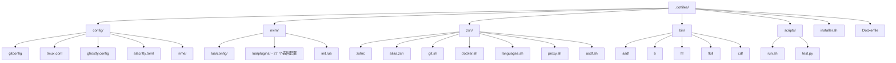

<!-- 此文件由 scripts/fetch-linux-readme.mjs 在构建时自动生成，请勿手动修改。 -->

# 🏠 我的 Dotfiles

个人开发环境配置集合 | 统一跨设备体验

   


> 💡 **现代化开发环境配置** - 基于 Zsh + Neovim + Tmux + Ghostty 的高效工作流

---

## 📑 目录

| 🚀 快速开始 | 💡 推荐工具 | 🔧 配置与使用 |
|-------------|-------------|---------------|
| [环境准备](#-环境准备) | [终端工具](#-推荐工具) | [Rime 输入法](#-rime-输入法-fcitx5-rime) |
| [一键安装](#-安装) | [效率提升](#-推荐工具) | [asdf 加速](#asdf-环境加速) |
| [配置生效](#-安装) | | [Tmux 插件](#-tmux-插件管理) |

| 🤔 故障排除 | 🏗️ 项目结构 | 🤝 贡献指南 |
|-------------|-------------|-------------|
| [Neovim 问题](#-neovim-报错或缓存问题) | [目录说明](#-项目结构) | [提交 PR](#-贡献) |
| [WSL 剪贴板](#-wsl-与-windows-剪贴板集成) | [文件组织](#-项目结构) | [问题反馈](#-贡献) |

---

## 🛠️ 技术栈

<details>
<summary>📦 技术栈徽章（Zsh / Neovim / Tmux / Ghostty / asdf ...）</summary>

| 🎯 核心工具 | 📝 编辑器 | 🖥️ 终端 | 🔧 开发环境 |
|-------------|-----------|---------|-------------|
|  |  |  |  |
|  |  |  |  |
|  |  |  |  |

</details>

### 📦 配置概览

<details>
<summary>📂 各配置项路径与功能一览</summary>

| 🔧 配置项 | 📁 路径 | 🎯 功能 | ⭐ 特点 |
|-----------|---------|---------|---------|
| **Shell 环境** | `zsh/` | Zsh 配置与主题 | 自定义主题 + 智能别名 + fzf 集成 |
| **编辑器配置** | `nvim/` | Neovim + vim.pack | LSP + Treesitter + 27 个插件配置 |
| **终端复用** | `config/tmux.conf` | Tmux 会话管理 | Catppuccin 主题 + vim 导航 |
| **现代终端** | `config/ghostty.config` | Ghostty 终端设置 | GPU 加速 + Maple Mono 字体 |
| **输入法** | `config/rime/` | Rime 中文输入 | 自定义词库 + 快捷输入 |
| **开发工具** | `config/` | Git/Docker/Python | 统一配置 + 环境优化 |

</details>

### 🎯 Neovim 插件列表

<details>
<summary>🧩 查看完整插件列表（27 个插件配置文件）</summary>

| 类别 | 插件 | 功能 |
|------|------|------|
| **核心库** | plenary.nvim, nvim-web-devicons, nui.nvim | 基础依赖 |
| **UI 界面** | catppuccin, lualine.nvim, bufferline.nvim, noice.nvim, which-key.nvim | 主题 + 状态栏 + 标签栏 + 命令行 + 快捷键提示 |
| **文件导航** | flash.nvim, neo-tree.nvim | 快速跳转 + 文件树 |
| **LSP 语法** | mason.nvim, mason-lspconfig.nvim, nvim-lspconfig, nvim-treesitter, nvim-treesitter-textobjects, nvim-ts-autotag, nvim-lint, trouble.nvim | 语言服务 + 语法高亮 + 诊断 |
| **代码补全** | blink.cmp, conform.nvim, friendly-snippets, ts-comments.nvim, mini.nvim | 自动补全 + 格式化 + 代码注释 |
| **搜索工具** | telescope.nvim, snacks.nvim | 模糊搜索 + 通知 |
| **Git 集成** | gitsigns.nvim, vim-fugitive, diffview.nvim, persistence.nvim | Git 状态 + 命令 + Diff 视图 + 会话管理 |
| **AI 辅助** | lazydev.nvim, copilot.vim, windsurf.vim | Lua 开发 + AI 代码补全 |
| **实用工具** | vim-translator, undotree | 翻译 + 撤销树 |

</details>

### 🔧 LSP 服务器配置

<details>
<summary>🌐 查看已配置的 LSP 服务器清单</summary>

| 语言 | LSP 服务器 | 功能 |
|------|------------|------|
| **Go** | gopls | Go 语言服务 |
| **Lua** | lua_ls | Lua 语言服务 (Neovim 配置开发) |
| **Python** | ruff + pylsp | Python 代码检查 + 语言服务 |
| **TypeScript/JavaScript** | ts_ls | TypeScript/JavaScript 语言服务 |
| **YAML** | yamlls | YAML 语言服务 (GitHub Actions, Docker Compose) |
| **Docker** | dockerls | Dockerfile 语言服务 |

</details>

### 🐚 Zsh 插件

<details>
<summary>🧾 查看 Zsh 插件清单</summary>

| 插件 | 功能 |
|------|------|
| **zsh-autosuggestions** | 命令自动建议 |
| **zsh-syntax-highlighting** | 语法高亮 |
| **web-search** | 网页搜索 |
| **zsh-you-should-use** | 别名提醒 |

</details>

### 🖥️ Tmux 插件

<details>
<summary>🧾 查看 Tmux 插件清单</summary>

| 插件 | 功能 |
|------|------|
| **tpm** | Tmux 插件管理器 |
| **catppuccin/tmux** | Catppuccin Mocha 主题 |
| **tmux-cpu** | CPU 使用率显示 |
| **tmux-yank** | 剪贴板集成 |
| **tmux-resurrect** | 会话恢复 |

</details>

### 🐳 Docker 管理工具

<details>
<summary>🐧 查看 Docker 快捷命令清单</summary>

| 命令 | 功能 | 说明 |
|------|------|------|
| `dfzf` | Docker 交互式管理 | fzf 驱动的容器/镜像/Volume/Network 管理 |
| `docexec` | 进入容器 | fzf 选择容器并进入 shell |
| `doclog` | 查看日志 | fzf 选择容器并查看日志 |
| `doiclean` | 清理镜像 | 多选删除 Docker 镜像 |
| `doclean` | 清理容器 | 多选删除 Docker 容器 |
| `dovclean` | 清理 Volume | 多选删除 Docker Volume |

</details>

### 🌐 代理配置

<details>
<summary>🛰️ 查看代理相关命令清单</summary>

| 命令 | 功能 | 说明 |
|------|------|------|
| `setproxy` | 设置代理 | 设置 HTTP/HTTPS/SOCKS 代理 |
| `unsetproxy` | 取消代理 | 取消所有代理设置 |
| `px <cmd>` | 临时代理 | 单次命令使用代理 |
| `macproxysetup` | Mac 代理 | 配置 macOS 系统代理 |

</details>

---

## 🚀 快速开始

### 📋 环境准备

```bash
# 🎯 一键安装核心依赖 (Ubuntu/Debian)
git zsh neovim tmux ripgrep fzf

# 🐧 使用 asdf 管理多版本环境
git clone --depth=1 https://github.com/asdf-vm/asdf.git ~/.asdf
```

#### 🔍 依赖清单

<details>
<summary>📥 查看依赖清单与必需性</summary>

| 📦 类别 | 🛠️ 工具 | 📝 说明 | 🌟 必需性 |
|---------|---------|---------|-----------|
| **核心环境** | `git` `zsh` `neovim` `tmux` | 基础开发工具链 | ⭐⭐⭐ |
| **版本管理** | `asdf` | 多语言环境管理 | ⭐⭐ |
| **编辑器增强** | `ripgrep` `fzf` `fd` `bat` | Neovim 搜索与预览 | ⭐⭐ |
| **终端工具** | `lsd` `zoxide` `delta` | 现代化命令行体验 | ⭐⭐ |
| **剪贴板支持** | `xclip`/`xsel` | Linux X11 剪贴板 | ⭐ |
| **WSL 专用** | `win32yank.exe` | Windows 剪贴板桥接 | ⭐ (WSL) |
| **中文输入** | `fcitx5-rime` | 中文输入法 | ⭐ (可选) |

</details>

### ⚡ 一键安装

```bash
# 🚀 克隆配置仓库
git clone https://github.com/hjkl01/dotfiles ~/.dotfiles
cd ~/.dotfiles

# 🔗 智能链接配置文件
bash ./installer.sh link

# 🐚 切换到 Zsh Shell
chsh -s $(which zsh)
```

#### 🌐 加速选项 (可选)

```bash
# 🇨🇳 使用 GitHub 镜像加速 (国内用户推荐)
git config --global url."https://gh.hjkl01.cn/https://github.com".insteadOf "https://github.com"
```

#### ✅ 安装验证

```bash
# 🔄 重新加载配置
source ~/.zshrc

# 🎉 验证安装
echo "✅ Dotfiles 安装完成！"
echo "📁 配置位置: ~/.dotfiles"
echo "🐚 当前 Shell: $SHELL"
```

> 💡 **提示**: 安装完成后重启终端或运行 `source ~/.zshrc` 使配置生效。

---

## 💡 推荐工具

### 🎯 效率提升工具集

<details>
<summary>🛠️ 查看效率工具清单与安装命令</summary>

| 🛠️ 工具 | 📝 功能 | 🌟 推荐指数 | 🚀 安装命令 |
|---------|---------|-----------|-------------|
| **lsd** | 现代化 `ls` | ⭐⭐⭐⭐⭐ | `cargo install lsd` |
| **zoxide** | 智能目录跳转 | ⭐⭐⭐⭐⭐ | `cargo install zoxide` |
| **fd** | 友好 `find` 替代 | ⭐⭐⭐⭐ | `cargo install fd-find` |
| **bat** | 现代 `cat` 替代 | ⭐⭐⭐⭐⭐ | `cargo install bat` |
| **delta** | Git diff 美化 | ⭐⭐⭐⭐ | `cargo install git-delta` |
| **lazygit** | TUI Git 客户端 | ⭐⭐⭐⭐⭐ | `cargo install lazygit` |
| **yazi** | 现代文件管理器 | ⭐⭐⭐⭐⭐ | `cargo install yazi` |
| **dust** | 目录大小分析 | ⭐⭐⭐ | `cargo install dust` |
| **broot** | 交互式目录树 | ⭐⭐⭐⭐ | `cargo install broot` |

</details>

#### 🎨 终端美化

```bash
# 🎨 安装 Nerd Font (推荐 Maple Mono NF CN)
# Ghostty: 已配置 Maple Mono NF CN
# Alacritty: 已配置 JetBrainsMono Nerd Font
```

#### 📊 系统监控

<details>
<summary>📈 查看系统监控工具清单</summary>

| 🔍 工具 | 📊 用途 | ⭐ 特点 |
|---------|---------|---------|
| **htop** | 进程监控 | 交互式界面 |
| **ncdu** | 磁盘分析 | 可视化占用 |
| **tree** | 目录树 | 结构化显示 |
| **proxychains-ng** | 网络代理 | 终端代理支持 |

</details>

---

## 🔧 高级配置

### 🈚 Rime 输入法配置

```bash
# 📦 安装 fcitx5-rime (Arch Linux)
sudo pacman -S fcitx5 fcitx5-rime fcitx5-configtool

# 🚀 自动化部署工具
git clone --depth=1 https://github.com/Mark24Code/rime-auto-deploy
cd rime-auto-deploy && ./installer.rb
```

#### ⚙️ 环境变量配置

```bash
# 🌐 添加到 ~/.profile 或 /etc/environment
export GTK_IM_MODULE=fcitx
export QT_IM_MODULE=fcitx
export XMODIFIERS="@im=fcitx"

# 🍎 macOS 重载配置
/Library/Input\ Methods/Squirrel.app/Contents/MacOS/Squirrel --reload
```

### 🚀 asdf 环境加速

```bash
# 🐍 Python 镜像加速 (添加到 ~/.zshrc)
export PYTHON_BUILD_MIRROR_URL="https://registry.npmmirror.com/-/binary/python"

# 📦 Node.js 镜像加速
export NODE_BUILD_MIRROR_URL="https://npmmirror.com/mirrors/node"

# 🦀 Rust 镜像加速
export RUSTUP_DIST_SERVER="https://rsproxy.cn"
export RUSTUP_UPDATE_ROOT="https://rsproxy.cn/rustup"
```

#### 💡 加速效果对比

<details>
<summary>⚡ 查看镜像加速效果对比</summary>

| 🐍 语言 | 🌐 官方源 | 🇨🇳 镜像源 | ⚡ 加速比 |
|---------|---------|-----------|---------|
| **Python** | ~5分钟 | ~30秒 | **10x** |
| **Node.js** | ~3分钟 | ~20秒 | **9x** |
| **Rust** | ~8分钟 | ~45秒 | **11x** |

</details>

### 🖥️ Tmux 插件管理

<details>
<summary>⌨️ 查看 Tmux 插件管理快捷键</summary>

| ⌨️ 快捷键 | 🎯 功能 | 📝 说明 |
|-----------|---------|---------|
| `prefix + I` | 安装插件 | Install plugins |
| `prefix + U` | 更新插件 | Update plugins |
| `prefix + alt + u` | 卸载插件 | Uninstall plugins |

</details>

#### 🔄 自动化更新

```bash
# ⏰ 设置定时任务 (每天 8:50 自动更新)
echo "50 8 * * * git -C $HOME/.dotfiles pull" | crontab -

# 🎯 手动更新
cd ~/.dotfiles && git pull && bash ./installer.sh link
```

---

## 🆘 故障排除

### 🐛 Neovim 问题诊断

```bash
# 🧹 清理缓存和插件
rm -rf ~/.local/share/nvim/ ~/.cache/nvim/

# 🔍 检查配置
nvim --check-health

# 🚀 重新安装（vim.pack）
nvim --headless "+lua vim.pack.update()" +qa

# 🔧 检查 LSP 状态
:LspInfo

# 🎨 更新 Treesitter 语法高亮
:TSUpdate
```

#### 📊 常见问题

<details>
<summary>🚨 查看常见问题与解决方案</summary>

| 🚨 问题 | 🔧 解决方案 | ✅ 验证 |
|---------|-------------|---------|
| **插件加载失败** | 清理缓存后执行 `vim.pack` 更新 | `:checkhealth` |
| **LSP 不工作** | 检查语言服务器安装 | `:LspInfo` |
| **语法高亮异常** | 更新/安装 treesitter parser | `:TSUpdate` / `:TSInstall <lang>` |
| **Copilot 不工作** | 设置环境变量 `NVIM_ENABLE_COPILOT=1` | 重启 Neovim |

</details>

#### 🔑 Neovim 快捷键速查

<details>
<summary>⌨️ 查看 Neovim 快捷键速查表</summary>

| ⌨️ 快捷键 | 🎯 功能 | 📝 说明 |
|-----------|---------|---------|
| `<leader>ff` | 查找文件 | Telescope 文件搜索 |
| `<leader>fg` | 全局搜索 | Telescope 内容搜索 |
| `<leader>e` | 文件树 | Neo-tree 文件浏览器 |
| `<leader>gs` | Git 状态 | Fugitive Git 命令 |
| `<leader>dv` | Diff 视图 | Diffview 打开 |
| `<leader>u` | 撤销树 | Undotree 切换 |
| `gd` | 跳转定义 | LSP 定义跳转 |
| `gr` | 查看引用 | LSP 引用查看 |

</details>

### 🪟 WSL 剪贴板配置

```bash
# 📥 下载 win32yank
wget https://github.com/equalsraf/win32yank/releases/download/v0.1.1/win32yank-x64.zip
unzip win32yank-x64.zip -d ~/.local/bin/
chmod +x ~/.local/bin/win32yank.exe

# 🔗 配置 Neovim 剪贴板
echo 'let g:clipboard = {"name": "win32yank", "copy": {"+": "win32yank.exe -i --crlf"}, "paste": {"+": "win32yank.exe -o --lf"}}' >> ~/.config/nvim/init.lua
```

---

## 📁 项目结构

<details>
<summary>🏗️ 查看项目结构树</summary>



</details>

#### 📂 详细目录说明

<details>
<summary>📇 查看目录与文件清单</summary>

| 📁 目录 | 📄 主要文件 | 🎯 用途 | ⭐ 重要度 |
|---------|-------------|---------|-----------|
| **config/** | `tmux.conf`, `ghostty.config`, `gitconfig` | 终端和应用配置 | ⭐⭐⭐⭐⭐ |
| **nvim/lua/config/** | `options.lua`, `keymaps.lua`, `pack.lua` | Neovim 核心配置 | ⭐⭐⭐⭐⭐ |
| **nvim/lua/plugins/** | 27 个 `.lua` 文件 | Neovim 插件配置 | ⭐⭐⭐⭐⭐ |
| **zsh/** | `zshrc`, `alias.zsh`, `docker.sh` | Shell 环境配置 | ⭐⭐⭐⭐⭐ |
| **bin/** | `asdf`, `b`, `fif`, `fkill`, `cdf` | 自定义脚本工具 | ⭐⭐⭐ |
| **scripts/** | `run.sh`, `test.py` | 项目辅助脚本 | ⭐⭐ |
| **.github/** | `workflows/` | CI/CD 配置 | ⭐ |

</details>

#### 🔧 安装脚本功能

```bash
# 📋 installer.sh 支持的操作
./installer.sh link    # 🔗 链接配置文件
./installer.sh unlink  # 🔓 取消链接
./installer.sh backup  # 💾 备份现有配置
./installer.sh restore # 🔄 恢复备份
```

---

## 🤝 贡献指南

### 🎯 如何贡献

| 📝 方式 | 🔗 链接 | 📋 说明 |
|---------|---------|---------|
| **🐛 报告问题** | [Issues](https://github.com/hjkl01/dotfiles/issues) | 发现 Bug 或配置问题 |
| **💡 功能建议** | [Discussions](https://github.com/hjkl01/dotfiles/discussions) | 提出改进建议 |
| **🔧 提交代码** | [Pull Requests](https://github.com/hjkl01/dotfiles/pulls) | 直接贡献配置 |

#### 📝 贡献流程

```bash
# 1. 🍴 Fork 仓库
# 2. 🌿 创建功能分支
git checkout -b feature/amazing-feature

# 3. 💾 提交更改
git commit -m "✨ Add amazing feature"

# 4. 📤 推送分支
git push origin feature/amazing-feature

# 5. 🔄 创建 Pull Request
```

#### 🎨 代码规范

- 📝 使用清晰的提交信息
- 🧹 保持配置文件整洁
- 📖 添加必要的注释说明
- 🧪 测试配置的兼容性

---

## 🙏 致谢

<details>
<summary>🌟 致谢的项目清单</summary>

| 🌟 项目 | 🔗 链接 | 📝 贡献 |
|---------|---------|---------|
| **Neovim** | [Neovim](https://github.com/neovim/neovim) | 内置 `vim.pack` 与编辑器生态 |
| **NvChad** | [NvChad](https://github.com/NvChad/NvChad) | 配置灵感来源 |
| **Oh My Zsh** | [Oh My Zsh](https://github.com/ohmyzsh/ohmyzsh) | Zsh 插件生态 |
| **TPM** | [TPM](https://github.com/tmux-plugins/tpm) | Tmux 插件管理 |

</details>

---

## 📄 许可证


本项目采用 **MIT 许可证** - 查看 [LICENSE](https://github.com/hjkl01/dotfiles/blob/master/LICENSE) 文件了解详情。

---

**⭐ 如果这个项目对你有帮助，请给一个 Star！**

**📧 联系方式**: [GitHub Issues](https://github.com/hjkl01/dotfiles/issues)

